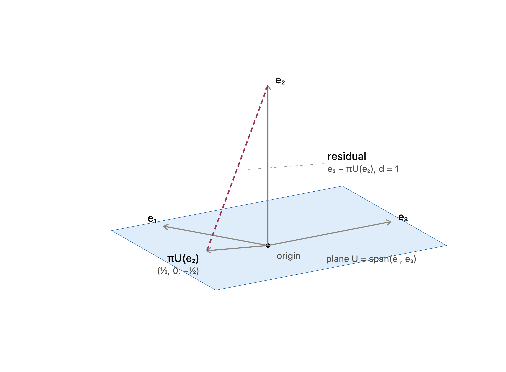

# Chapter 3 · Analytic Geometry

End-of-chapter exercises. Each has a definitions box, explanation, worked steps, and the answer.

---

## 3.1 · Show that $\langle\cdot,\cdot\rangle$ is an inner product

!!! theory "Topics & Definitions"
    - **Inner product** — a map $\langle\cdot,\cdot\rangle$ taking two vectors to a number, passing three tests for all $\mathbf{x},\mathbf{y},\mathbf{z}$ and scalars.
    - **Bilinear** — linear in each slot separately (constants and sums pass straight through).
    - **Symmetric** — order does not matter: $\langle\mathbf{x},\mathbf{y}\rangle = \langle\mathbf{y},\mathbf{x}\rangle$.
    - **Positive definite** — $\langle\mathbf{x},\mathbf{x}\rangle > 0$ for every $\mathbf{x}\neq\mathbf{0}$ (and $0$ only for $\mathbf{0}$).
    - **Matrix shortcut** — any $\langle\mathbf{x},\mathbf{y}\rangle = \mathbf{x}^\top A\,\mathbf{y}$ is automatically bilinear; it is symmetric exactly when $A = A^\top$, and positive definite exactly when $A$ is (leading minors all positive).

The form $\langle\mathbf{x},\mathbf{y}\rangle = x_1y_1 - (x_1y_2 + x_2y_1) + 2x_2y_2$ is a matrix form in disguise. Pulling the coefficients into a grid gives $A = \begin{bmatrix}1&-1\\-1&2\end{bmatrix}$, so $\langle\mathbf{x},\mathbf{y}\rangle = \mathbf{x}^\top A\,\mathbf{y}$. Because it is built as $\mathbf{x}^\top A\mathbf{y}$ it is bilinear for free, and the two remaining checks are just facts about $A$.

!!! steps "Check the three properties"
    **Matrix form.** $\mathbf{x}^\top A\mathbf{y} = (x_1 - x_2)y_1 + (-x_1 + 2x_2)y_2 = x_1y_1 - x_1y_2 - x_2y_1 + 2x_2y_2$, matching the given form.

    **Symmetric.** $A = \begin{bmatrix}1&-1\\-1&2\end{bmatrix} = A^\top$, so $\langle\mathbf{x},\mathbf{y}\rangle = \langle\mathbf{y},\mathbf{x}\rangle$.

    **Positive definite.** Leading principal minors of $A$: the top-left entry $1 > 0$, and $\det A = (1)(2) - (-1)(-1) = 1 > 0$. Both positive, so $A$ is positive definite. Equivalently, completing the square,
    $$\langle\mathbf{x},\mathbf{x}\rangle = x_1^2 - 2x_1x_2 + 2x_2^2 = (x_1 - x_2)^2 + x_2^2 \ge 0,$$
    which is $0$ only when $x_1 = x_2 = 0$.

!!! answer "Answer"
    All three properties hold, so $\langle\cdot,\cdot\rangle$ **is an inner product** on $\mathbb{R}^2$ (with matrix $A = \begin{bmatrix}1&-1\\-1&2\end{bmatrix}$).

---

## 3.2 · Is $\langle\mathbf{x},\mathbf{y}\rangle = \mathbf{x}^\top A\,\mathbf{y}$ an inner product?

!!! theory "Topics & Definitions"
    - **Symmetry is required** — every inner product must satisfy $\langle\mathbf{x},\mathbf{y}\rangle = \langle\mathbf{y},\mathbf{x}\rangle$.
    - **Matrix test** — for $\mathbf{x}^\top A\mathbf{y}$, symmetry holds for all vectors **iff** $A = A^\top$.
    - **One counterexample is enough** — to disprove, find a single pair where $\langle\mathbf{x},\mathbf{y}\rangle \neq \langle\mathbf{y},\mathbf{x}\rangle$.

Here $A = \begin{bmatrix}2&0\\1&2\end{bmatrix}$, and $A^\top = \begin{bmatrix}2&1\\0&2\end{bmatrix} \neq A$. Since $A$ is not symmetric, the form should fail the symmetry test, and a single well-chosen pair exposes it.

!!! steps "Counterexample with $\mathbf{x} = (2,0)^\top$, $\mathbf{y} = (0,2)^\top$"
    $$\langle\mathbf{x},\mathbf{y}\rangle = \mathbf{x}^\top A\mathbf{y} = \begin{bmatrix}2&0\end{bmatrix}\begin{bmatrix}2&0\\1&2\end{bmatrix}\begin{bmatrix}0\\2\end{bmatrix} = \begin{bmatrix}2&0\end{bmatrix}\begin{bmatrix}0\\4\end{bmatrix} = 0.$$

    $$\langle\mathbf{y},\mathbf{x}\rangle = \mathbf{y}^\top A\mathbf{x} = \begin{bmatrix}0&2\end{bmatrix}\begin{bmatrix}2&0\\1&2\end{bmatrix}\begin{bmatrix}2\\0\end{bmatrix} = \begin{bmatrix}0&2\end{bmatrix}\begin{bmatrix}4\\2\end{bmatrix} = 4.$$
    Since $0 \neq 4$, the form is not symmetric.

!!! answer "Answer"
    **Not an inner product.** With $\mathbf{x} = (2,0)^\top,\ \mathbf{y} = (0,2)^\top$ we get $\langle\mathbf{x},\mathbf{y}\rangle = 0$ but $\langle\mathbf{y},\mathbf{x}\rangle = 4$, so symmetry fails (because $A \neq A^\top$).

---

## 3.3 · Distance between two vectors

!!! theory "Topics & Definitions"
    - **Induced norm** — an inner product gives a length: $\lVert\mathbf{v}\rVert = \sqrt{\langle\mathbf{v},\mathbf{v}\rangle}$.
    - **Distance** — the length of the difference vector: $d(\mathbf{x},\mathbf{y}) = \lVert\mathbf{x}-\mathbf{y}\rVert = \sqrt{\langle\mathbf{x}-\mathbf{y},\ \mathbf{x}-\mathbf{y}\rangle}$.
    - **Method** — subtract first to get the arrow $\mathbf{x}-\mathbf{y}$, feed that single vector into the inner product, then square-root.
    - **Which inner product matters** — a different inner product (a different matrix $A$) measures a different distance for the same two points.

Distance is just the length of the arrow joining the points. So compute $\mathbf{x}-\mathbf{y}$ once, then take the inner product of that difference with itself and square-root it. With $\mathbf{x} = (1,2,3)^\top$ and $\mathbf{y} = (-1,-1,0)^\top$, the difference is $\mathbf{x}-\mathbf{y} = (2,3,3)^\top$ for both parts; only the inner product changes.

!!! steps "Part a, dot product $\langle\mathbf{x},\mathbf{y}\rangle = \mathbf{x}^\top\mathbf{y}$"
    $$\mathbf{x}-\mathbf{y} = (2,3,3)^\top, \qquad \langle\mathbf{x}-\mathbf{y},\mathbf{x}-\mathbf{y}\rangle = 2^2 + 3^2 + 3^2 = 22.$$

    $$d = \sqrt{22} \approx 4.69.$$

!!! steps "Part b, weighted product $\langle\mathbf{x},\mathbf{y}\rangle = \mathbf{x}^\top A\mathbf{y}$"
    With $A = \begin{bmatrix}2&1&0\\1&3&-1\\0&-1&2\end{bmatrix}$ and $\mathbf{d} = \mathbf{x}-\mathbf{y} = (2,3,3)^\top$, first apply $A$:
    $$A\mathbf{d} = \begin{bmatrix}2&1&0\\1&3&-1\\0&-1&2\end{bmatrix}\begin{bmatrix}2\\3\\3\end{bmatrix} = \begin{bmatrix}7\\8\\3\end{bmatrix},\qquad \mathbf{d}^\top A\mathbf{d} = 2(7)+3(8)+3(3) = 47.$$

    $$d = \sqrt{47} \approx 6.86.$$

!!! answer "Answer"
    **a)** $d = \sqrt{22} \approx 4.69$. &nbsp;&nbsp; **b)** $d = \sqrt{47} \approx 6.86$.

---

## 3.4 · Angle between two vectors

!!! theory "Topics & Definitions"
    - **Angle formula** — $\cos\theta = \dfrac{\langle\mathbf{x},\mathbf{y}\rangle}{\lVert\mathbf{x}\rVert\,\lVert\mathbf{y}\rVert}$, then $\theta = \arccos(\cdots)$.
    - **Work it in pieces** — compute the inner product on top first, then each magnitude $\lVert\mathbf{x}\rVert = \sqrt{\langle\mathbf{x},\mathbf{x}\rangle}$, then combine.
    - **Sign of the cosine** — a negative value means an obtuse angle (more than $90^\circ$).
    - **Different inner product, different angle** — swapping the dot product for $\mathbf{x}^\top B\mathbf{y}$ reshapes what "angle" means.

Build the ratio one piece at a time: the inner product in the numerator, the two lengths in the denominator, then plug into $\arccos$. Here $\mathbf{x} = (1,2)^\top$ and $\mathbf{y} = (-1,-1)^\top$.

!!! steps "Part a, dot product $\langle\mathbf{x},\mathbf{y}\rangle = \mathbf{x}^\top\mathbf{y}$"
    Inner product: $\langle\mathbf{x},\mathbf{y}\rangle = (1)(-1) + (2)(-1) = -3$.
    Magnitudes: $\lVert\mathbf{x}\rVert = \sqrt{1^2+2^2} = \sqrt{5}$, $\lVert\mathbf{y}\rVert = \sqrt{(-1)^2+(-1)^2} = \sqrt{2}$.
    Combine:
    $$\cos\theta = \frac{-3}{\sqrt{5}\,\sqrt{2}} = \frac{-3}{\sqrt{10}} \approx -0.9487 \;\Rightarrow\; \theta \approx 161.57^\circ \approx 2.82\ \text{rad}.$$

!!! steps "Part b, weighted product $\langle\mathbf{x},\mathbf{y}\rangle = \mathbf{x}^\top B\mathbf{y}$"
    With $B = \begin{bmatrix}2&1\\1&3\end{bmatrix}$, take it a piece at a time.
    Inner product: $B\mathbf{y} = \begin{bmatrix}2&1\\1&3\end{bmatrix}\begin{bmatrix}-1\\-1\end{bmatrix} = \begin{bmatrix}-3\\-4\end{bmatrix}$, so $\langle\mathbf{x},\mathbf{y}\rangle = \mathbf{x}^\top B\mathbf{y} = (1)(-3)+(2)(-4) = -11$.
    Magnitudes: $\lVert\mathbf{x}\rVert_B = \sqrt{\mathbf{x}^\top B\mathbf{x}} = \sqrt{18}$, $\lVert\mathbf{y}\rVert_B = \sqrt{\mathbf{y}^\top B\mathbf{y}} = \sqrt{7}$.
    Combine:
    $$\cos\theta = \frac{-11}{\sqrt{18}\,\sqrt{7}} = \frac{-11}{\sqrt{126}} \approx -0.9800 \;\Rightarrow\; \theta \approx 168.51^\circ \approx 2.94\ \text{rad}.$$

!!! answer "Answer"
    **a)** $\theta \approx 161.57^\circ \approx 2.82$ rad. &nbsp;&nbsp; **b)** $\theta \approx 168.51^\circ \approx 2.94$ rad.

    Both angles are obtuse (negative cosine); the weighted inner product in b pushes the angle slightly wider.

---

## 3.5 · Orthogonal projection onto a subspace

In $\mathbb{R}^5$ with the standard dot product, a subspace $U$ and a vector $x$ are given by
$$U = \operatorname{span}\left[\begin{pmatrix}0\\-1\\2\\0\\2\end{pmatrix},\begin{pmatrix}1\\-3\\1\\-1\\2\end{pmatrix},\begin{pmatrix}-3\\4\\1\\2\\1\end{pmatrix},\begin{pmatrix}-1\\-3\\5\\0\\7\end{pmatrix}\right], \qquad x = \begin{pmatrix}-1\\-9\\-1\\4\\1\end{pmatrix}.$$

Find **(a)** the orthogonal projection $\pi_U(x)$ and **(b)** the distance $d(x,U)$.

!!! theory "Topics & Definitions"
    - **Orthogonal projection onto a subspace** — if the columns of $B$ form a basis of $U$, then $\pi_U(x) = B(B^\top B)^{-1}B^\top x$. The coordinates $\lambda = (B^\top B)^{-1}B^\top x$ solve the normal equations $B^\top B\,\lambda = B^\top x$, and $\pi_U(x) = B\lambda$.
    - **$B$ needs a basis, not just a spanning set** — the four given vectors are **not** independent, so stacking all four makes $B^\top B$ singular (non-invertible). Trim to a genuine basis first.
    - **Distance to a subspace** — the projection is the closest point in $U$ to $x$, so $d(x,U) = \lVert x - \pi_U(x)\rVert$. The residual $x-\pi_U(x)$ is orthogonal to every basis vector, a handy way to check.

The four spanning vectors are not linearly independent, so the first job is to trim them to a real basis. Then build $B$ from those basis vectors, solve the normal equations for the coordinates $\lambda$, and assemble the projection. The distance is just the length of what is left over.

!!! steps "Step 1, trim the spanning set to a basis (RREF)"
    Stack the four spanning vectors as columns of $A$ and row-reduce to find the pivot columns:
    $$A = \begin{pmatrix}0&1&-3&-1\\-1&-3&4&-3\\2&1&1&5\\0&-1&2&0\\2&2&1&7\end{pmatrix} \xrightarrow{\text{RREF}} \begin{pmatrix}1&0&0&1\\0&1&0&2\\0&0&1&1\\0&0&0&0\\0&0&0&0\end{pmatrix}.$$
    Pivots sit in columns 1, 2, 3, so those three vectors form a basis of $U$. Column 4 is dependent: reading off the last RREF column, $v_4 = v_1 + 2v_2 + v_3$.

!!! note "Pitfall"
    Take the basis vectors from the **original** matrix $A$, never from the RREF. Row reduction only *identifies* which columns are independent; it changes the columns themselves.

!!! steps "Step 2, build $B$ and compute $B^\top B$"
    $$B = \begin{pmatrix}0&1&-3\\-1&-3&4\\2&1&1\\0&-1&2\\2&2&1\end{pmatrix}, \qquad B^\top B = \begin{pmatrix}9&9&0\\9&16&-14\\0&-14&31\end{pmatrix}.$$
    Each entry is a dot product of two columns of $B$; the matrix is symmetric, so only six of the nine entries need computing.

!!! steps "Step 3, solve the normal equations for $\lambda$"
    $$B^\top x = \begin{pmatrix}9\\23\\-25\end{pmatrix}, \qquad \lambda = (B^\top B)^{-1}B^\top x = \begin{pmatrix}-3\\4\\1\end{pmatrix}.$$
    The coordinates come out as clean integers, a good sign the arithmetic is right.

!!! steps "Step 4, projection and distance"
    $$\pi_U(x) = B\lambda = \begin{pmatrix}1\\-5\\-1\\-2\\3\end{pmatrix}.$$

    The residual is
    $$x - \pi_U(x) = \begin{pmatrix}-2\\-4\\0\\6\\-2\end{pmatrix},$$

    which is orthogonal to each basis vector (dotting with $v_1$: $0 + 4 + 0 + 0 - 4 = 0$). Its length is the distance:
    $$d(x,U) = \sqrt{(-2)^2 + (-4)^2 + 0^2 + 6^2 + (-2)^2} = \sqrt{60} = 2\sqrt{15}.$$

!!! answer "Answer"
    $$\pi_U(x) = \begin{pmatrix}1\\-5\\-1\\-2\\3\end{pmatrix}, \qquad d(x,U) = 2\sqrt{15} \approx 7.75.$$

---

## 3.6 · Projection under a non-standard inner product

In $\mathbb{R}^3$ with the inner product
$$\langle x,y\rangle := x^\top \begin{pmatrix}2&1&0\\1&2&-1\\0&-1&2\end{pmatrix} y,$$
let $e_1,e_2,e_3$ be the standard basis and $U = \operatorname{span}[e_1,e_3]$. Find **(a)** $\pi_U(e_2)$, **(b)** $d(e_2,U)$, and **(c)** a sketch of the scenario.

!!! theory "Topics & Definitions"
    - **Projection under a general inner product** — when $\langle x,y\rangle = x^\top A y$ for a symmetric positive-definite $A$, every inner-product slot gains an $A$: $\pi_U(x) = B(B^\top A B)^{-1}B^\top A\,x$. The standard dot product is just the case $A = I$.
    - **Reading inner products off $A$** — since $A_{ij} = \langle e_i,e_j\rangle$, here $\langle e_1,e_2\rangle = 1$ and $\langle e_2,e_3\rangle = -1$, so under this metric $e_2$ is **not** orthogonal to the plane $U$, which is exactly why the projection is nonzero.
    - **Distance with the same inner product** — $d(e_2,U) = \sqrt{\langle r,r\rangle} = \sqrt{r^\top A r}$ with $r = e_2 - \pi_U(e_2)$. A valid inner product always gives $\langle r,r\rangle \ge 0$; a negative value signals a slip.

Anywhere two vectors would normally be dotted, sandwich the matrix $A$ between them. Everything else (build $B$, solve for $\lambda$, assemble the projection, measure the leftover) runs exactly like the standard case.

!!! steps "Step 1, set up $B$, then $B^\top A B$ and $B^\top A e_2$"
    The basis of $U$ is $e_1,e_3$, so $B = \begin{pmatrix}1&0\\0&0\\0&1\end{pmatrix}$. Then
    $$B^\top A B = \begin{pmatrix}2&0\\0&2\end{pmatrix}, \qquad B^\top A e_2 = \begin{pmatrix}1\\-1\end{pmatrix}.$$
    ($A e_2$ is simply the second column of $A$: $(1,2,-1)^\top$.)

!!! steps "Step 2, solve for $\lambda$ and form the projection"
    $$\lambda = (B^\top A B)^{-1}B^\top A e_2 = \begin{pmatrix}\tfrac12&0\\0&\tfrac12\end{pmatrix}\begin{pmatrix}1\\-1\end{pmatrix} = \begin{pmatrix}\tfrac12\\-\tfrac12\end{pmatrix},$$

    $$\pi_U(e_2) = B\lambda = \tfrac12 e_1 - \tfrac12 e_3 = \begin{pmatrix}\tfrac12\\0\\-\tfrac12\end{pmatrix}.$$

!!! steps "Step 3, distance under the weighted norm"
    The residual is $r = e_2 - \pi_U(e_2) = \left(-\tfrac12,\ 1,\ \tfrac12\right)^\top$. Measure its length with the same inner product, not the plain norm:
    $$A r = \begin{pmatrix}0\\1\\0\end{pmatrix}, \qquad r^\top A r = \left(-\tfrac12\right)(0) + (1)(1) + \left(\tfrac12\right)(0) = 1,$$
    so $d(e_2,U) = \sqrt{1} = 1$.

!!! note "Common mistake"
    Using the plain norm $\sqrt{r^\top r} = \sqrt{3/2}$ here is wrong. Once the problem defines a weighted inner product, *every* length, angle, and orthogonality check uses that same inner product.

!!! answer "Answer"
    $$\pi_U(e_2) = \begin{pmatrix}\tfrac12\\0\\-\tfrac12\end{pmatrix}, \qquad d(e_2,U) = 1.$$

!!! note "Part c, the geometry"
    The plane $U = \operatorname{span}(e_1,e_3)$ is the floor; $e_1$ and $e_3$ lie in it and $e_2$ stands above the origin. Under the standard dot product $e_2$ is perpendicular to $U$, so its projection would be the origin. Under this weighted inner product $e_2$ leans toward $e_1$ ($\langle e_1,e_2\rangle = +1$) and away from $e_3$ ($\langle e_2,e_3\rangle = -1$), so the projection lands at $\left(\tfrac12,0,-\tfrac12\right)$: a diagonal in the plane, close to $e_1$ but pulled slightly toward $-e_3$. The dashed residual connects $e_2$ to $\pi_U(e_2)$ and its length is the distance $d = 1$.

    

---

## 3.7 · Projections and their complements

Let $V$ be a vector space and $\pi$ an endomorphism of $V$.

**(a)** Prove that $\pi$ is a projection if and only if $\operatorname{id}_V - \pi$ is a projection, where $\operatorname{id}_V$ is the identity endomorphism on $V$.

**(b)** Assuming $\pi$ is a projection, compute $\operatorname{Im}(\operatorname{id}_V - \pi)$ and $\ker(\operatorname{id}_V - \pi)$ in terms of $\operatorname{Im}(\pi)$ and $\ker(\pi)$.

!!! theory "Topics & Definitions"
    - **Projection $=$ idempotent** — an endomorphism $\pi$ is a projection exactly when $\pi^2 = \pi$. Once you have landed in the target subspace, projecting again does not move you.
    - **The identity behaves like $1$** — composing with $\operatorname{id}_V$ changes nothing: $\operatorname{id}\circ\pi = \pi$ and $\pi\circ\operatorname{id} = \pi$. This is what lets $(\operatorname{id} - \pi)^2$ expand like ordinary algebra.
    - **Two facts that drive part b** — a projection is the identity on its image ($\pi(v) = v$ for $v \in \operatorname{Im}(\pi)$) and zero on its kernel ($\pi(v) = 0$ for $v \in \ker(\pi)$), giving the split $V = \operatorname{Im}(\pi) \oplus \ker(\pi)$.
    - **Proving a set equality** — to show $A = B$, prove both inclusions $A \subseteq B$ and $B \subseteq A$.

Part a is pure algebra: expand $(\operatorname{id} - \pi)^2$ and watch the condition $\pi^2 = \pi$ appear. Part b then chases elements through $\operatorname{id} - \pi$, using $\pi^2 = \pi$ at each turn, to show the image and kernel simply swap.

!!! steps "Part a, expand $(\operatorname{id} - \pi)^2$"
    Write $\operatorname{id}$ for $\operatorname{id}_V$. Expanding the composition:
    $$(\operatorname{id} - \pi)^2 = \operatorname{id}\circ\operatorname{id} - \operatorname{id}\circ\pi - \pi\circ\operatorname{id} + \pi\circ\pi = \operatorname{id} - 2\pi + \pi^2.$$
    The two middle terms each collapse to $\pi$, since composing with the identity does nothing.

!!! steps "Part a, chain of equivalences"
    Now $\operatorname{id} - \pi$ is a projection precisely when it is idempotent:
    $$\begin{aligned}(\operatorname{id} - \pi)^2 = \operatorname{id} - \pi &\iff \operatorname{id} - 2\pi + \pi^2 = \operatorname{id} - \pi\\ &\iff -2\pi + \pi^2 = -\pi\\ &\iff \pi^2 = \pi.\end{aligned}$$
    Every step is a reversible equivalence (subtract $\operatorname{id}$, then add $2\pi$, to both sides), so the biconditional holds in both directions at once:
    $$\operatorname{id} - \pi \text{ is a projection} \iff \pi \text{ is a projection}. \qquad \blacksquare$$

!!! note "Why both directions come free"
    Because the chain uses $\iff$ rather than $\implies$, reading it top-to-bottom proves one direction and bottom-to-top proves the other. No separate argument is needed.

!!! steps "Part b, $\operatorname{Im}(\operatorname{id} - \pi) = \ker(\pi)$"
    **($\subseteq$)** Let $w \in \operatorname{Im}(\operatorname{id} - \pi)$, so $w = v - \pi(v)$ for some $v \in V$. Applying $\pi$ and using $\pi^2 = \pi$:
    $$\pi(w) = \pi(v) - \pi^2(v) = \pi(v) - \pi(v) = 0,$$
    so $w \in \ker(\pi)$.

    **($\supseteq$)** Let $w \in \ker(\pi)$, so $\pi(w) = 0$. Then
    $$(\operatorname{id} - \pi)(w) = w - \pi(w) = w - 0 = w,$$
    so $w$ is its own image under $\operatorname{id} - \pi$, hence $w \in \operatorname{Im}(\operatorname{id} - \pi)$.

    Both inclusions hold, so $\operatorname{Im}(\operatorname{id} - \pi) = \ker(\pi)$.

!!! steps "Part b, $\ker(\operatorname{id} - \pi) = \operatorname{Im}(\pi)$"
    **($\subseteq$)** Let $v \in \ker(\operatorname{id} - \pi)$, so $v - \pi(v) = 0$, giving $v = \pi(v)$. Then $v$ is $\pi$ of something, so $v \in \operatorname{Im}(\pi)$.

    **($\supseteq$)** Let $v \in \operatorname{Im}(\pi)$, so $v = \pi(u)$ for some $u \in V$. Then, using $\pi^2 = \pi$:
    $$(\operatorname{id} - \pi)(v) = \pi(u) - \pi^2(u) = \pi(u) - \pi(u) = 0,$$
    so $v \in \ker(\operatorname{id} - \pi)$.

    Both inclusions hold, so $\ker(\operatorname{id} - \pi) = \operatorname{Im}(\pi)$. $\blacksquare$

!!! answer "Answer"
    **a)** $\pi$ is a projection $\iff \pi^2 = \pi \iff (\operatorname{id}_V - \pi)^2 = \operatorname{id}_V - \pi \iff \operatorname{id}_V - \pi$ is a projection.

    **b)** The image and kernel swap:
    $$\operatorname{Im}(\operatorname{id}_V - \pi) = \ker(\pi), \qquad \ker(\operatorname{id}_V - \pi) = \operatorname{Im}(\pi).$$

    **Intuition.** A projection splits the space as $V = \operatorname{Im}(\pi) \oplus \ker(\pi)$, keeping the first part and killing the second. The complementary projection $\operatorname{id}_V - \pi$ does the exact opposite: it keeps what $\pi$ kills and kills what $\pi$ keeps, so their images and kernels trade places.

---

## 3.8 · Gram-Schmidt orthonormalisation

Using the Gram-Schmidt method, turn the basis $B = (b_1, b_2)$ of a two-dimensional subspace $U \subseteq \mathbb{R}^3$ into an orthonormal basis (ONB) $C = (c_1, c_2)$ of $U$, where
$$b_1 := \begin{pmatrix}1\\1\\1\end{pmatrix}, \qquad b_2 := \begin{pmatrix}-1\\2\\0\end{pmatrix}.$$

!!! theory "Topics & Definitions"
    - **Gram-Schmidt** — turns any basis into an orthonormal one, one vector at a time. The engine is the projection machinery: for each new vector, subtract off its projection onto everything already built, then normalise what is left.
    - **Orthogonal set** — build $u_1, u_2, \dots$ by $u_1 = v_1$ and $u_k = v_k - \sum_{j<k} \dfrac{\langle v_k, u_j\rangle}{\lVert u_j\rVert^2}\, u_j$. Each subtracted term removes the component of $v_k$ lying along a previous $u_j$, leaving a residual orthogonal to all of them.
    - **Normalise last** — once orthogonal, scale to unit length: $c_k = \dfrac{u_k}{\lVert u_k\rVert}$.

It is cleanest to orthogonalise first (get $u_1, u_2$), then normalise at the very end. Normalising as you go also works, but carrying square roots through the subtraction step is much messier by hand.

!!! steps "Step 1, first vector"
    Take $u_1 = b_1 = (1,1,1)^\top$, with $\lVert u_1\rVert = \sqrt{3}$. Normalising:
    $$c_1 = \frac{1}{\sqrt{3}}\begin{pmatrix}1\\1\\1\end{pmatrix}.$$

!!! steps "Step 2, subtract the projection from $b_2$"
    The projection coefficient of $b_2$ onto $u_1$:
    $$\frac{\langle b_2, u_1\rangle}{\lVert u_1\rVert^2} = \frac{-1 + 2 + 0}{3} = \frac{1}{3}.$$
    Subtract that component off:
    $$u_2 = b_2 - \tfrac13 u_1 = \begin{pmatrix}-1\\2\\0\end{pmatrix} - \tfrac13\begin{pmatrix}1\\1\\1\end{pmatrix} = \begin{pmatrix}-\tfrac43\\\tfrac53\\-\tfrac13\end{pmatrix}.$$

!!! note "Simplification"
    Scaling a vector does not change its direction, so $u_2$ can be rescaled to the clean integer vector $(-4, 5, -1)^\top$ before normalising. Same unit vector, far less fraction wrangling.

!!! steps "Step 3, normalise $u_2$"
    $$\lVert u_2\rVert = \sqrt{\tfrac{16}{9} + \tfrac{25}{9} + \tfrac{1}{9}} = \frac{\sqrt{42}}{3}.$$

    $$c_2 = \frac{u_2}{\lVert u_2\rVert} = \frac{1}{\sqrt{42}}\begin{pmatrix}-4\\5\\-1\end{pmatrix}.$$

!!! steps "Step 4, verify"
    $$\langle c_1, c_2\rangle = \frac{1}{\sqrt{3}\sqrt{42}}\big(-4 + 5 - 1\big) = 0 \quad\checkmark\ \text{orthogonal}.$$

    $$\lVert c_1\rVert = 1, \qquad \lVert c_2\rVert = \frac{\sqrt{16 + 25 + 1}}{\sqrt{42}} = 1 \quad\checkmark\ \text{normalised}.$$

!!! answer "Answer"
    $$c_1 = \frac{1}{\sqrt{3}}\begin{pmatrix}1\\1\\1\end{pmatrix}, \qquad c_2 = \frac{1}{\sqrt{42}}\begin{pmatrix}-4\\5\\-1\end{pmatrix}.$$

    Equivalently, with denominators rationalised,
    $$c_2 = \begin{pmatrix}-\tfrac{2\sqrt{42}}{21}\\[4pt] \tfrac{5\sqrt{42}}{42}\\[4pt] -\tfrac{\sqrt{42}}{42}\end{pmatrix}.$$
    Both forms are correct; the factored form is usually cleaner to read.

Reference: [Gram-Schmidt Process (Professor Dave Explains)](https://www.youtube.com/watch?v=zHbfZWZJTGc)

---

## 3.10 · Rotating vectors in the plane

Rotate the vectors
$$x_1 := \begin{pmatrix}2\\3\end{pmatrix}, \qquad x_2 := \begin{pmatrix}0\\-1\end{pmatrix}$$
by $30^\circ$.

!!! theory "Topics & Definitions"
    - **Rotation matrix** — in $\mathbb{R}^2$, an anticlockwise rotation by angle $\theta$ about the origin is the linear map $R(\theta) = \begin{pmatrix}\cos\theta & -\sin\theta\\\sin\theta & \cos\theta\end{pmatrix}$, and rotating is just $x \mapsto R(\theta)\,x$.
    - **Where it comes from** — the columns are the images of the standard basis vectors. Rotating $e_1 = (1,0)^\top$ lands it at $(\cos\theta, \sin\theta)^\top$ (column 1); rotating $e_2 = (0,1)^\top$ lands it at $(-\sin\theta, \cos\theta)^\top$ (column 2).
    - **Sign convention** — positive $\theta$ is anticlockwise. For clockwise, use $R(-\theta)$, which flips the signs of the two sine terms.
    - **Rotations are orthogonal maps** — $R(\theta)^\top R(\theta) = I$, so they preserve lengths and angles: $\lVert R(\theta)x\rVert = \lVert x\rVert$. That gives a free check on any answer.

A rotation just spins each vector about the origin without stretching it. Write down $R(30^\circ)$ once, multiply each vector through, and then confirm the lengths are unchanged as a sanity check.

!!! steps "Step 1, write down $R(30^\circ)$"
    With $\cos 30^\circ = \tfrac{\sqrt3}{2}$ and $\sin 30^\circ = \tfrac12$:
    $$R(30^\circ) = \begin{pmatrix}\cos 30^\circ & -\sin 30^\circ\\\sin 30^\circ & \cos 30^\circ\end{pmatrix} = \begin{pmatrix}\tfrac{\sqrt3}{2} & -\tfrac12\\[4pt] \tfrac12 & \tfrac{\sqrt3}{2}\end{pmatrix}.$$

!!! note "Keep the surds"
    Work with exact values $\tfrac{\sqrt3}{2}$ and $\tfrac12$ rather than decimals. Rounding early accumulates error and hides the structure of the answer.

!!! steps "Step 2, rotate $x_1$"
    $$R(30^\circ)\,x_1 = \begin{pmatrix}\tfrac{\sqrt3}{2} & -\tfrac12\\[4pt] \tfrac12 & \tfrac{\sqrt3}{2}\end{pmatrix}\begin{pmatrix}2\\3\end{pmatrix} = \begin{pmatrix}\tfrac{\sqrt3}{2}(2) - \tfrac12(3)\\[4pt] \tfrac12(2) + \tfrac{\sqrt3}{2}(3)\end{pmatrix} = \begin{pmatrix}\sqrt3 - \tfrac32\\[4pt] 1 + \tfrac{3\sqrt3}{2}\end{pmatrix} \approx \begin{pmatrix}0.232\\3.598\end{pmatrix}.$$

!!! steps "Step 3, rotate $x_2$"
    $$R(30^\circ)\,x_2 = \begin{pmatrix}\tfrac{\sqrt3}{2} & -\tfrac12\\[4pt] \tfrac12 & \tfrac{\sqrt3}{2}\end{pmatrix}\begin{pmatrix}0\\-1\end{pmatrix} = \begin{pmatrix}\tfrac{\sqrt3}{2}(0) - \tfrac12(-1)\\[4pt] \tfrac12(0) + \tfrac{\sqrt3}{2}(-1)\end{pmatrix} = \begin{pmatrix}\tfrac12\\[4pt] -\tfrac{\sqrt3}{2}\end{pmatrix} \approx \begin{pmatrix}0.5\\-0.866\end{pmatrix}.$$

    A nice cross-check: $x_2$ starts pointing straight down, at $270^\circ$. Rotating anticlockwise by $30^\circ$ lands it at $300^\circ$, and indeed $(\cos 300^\circ, \sin 300^\circ) = (\tfrac12, -\tfrac{\sqrt3}{2})$.

!!! steps "Step 4, verify lengths are preserved"
    Rotations are isometries, so the norms must be unchanged:
    $$\lVert x_1\rVert = \sqrt{4 + 9} = \sqrt{13}, \qquad \lVert R x_1\rVert = \sqrt{13} \quad\checkmark$$

    $$\lVert x_2\rVert = 1, \qquad \lVert R x_2\rVert = \sqrt{\tfrac14 + \tfrac34} = 1 \quad\checkmark$$

    If a rotated vector has a different length from the original, there is an arithmetic error somewhere.

!!! answer "Answer"
    $$R(30^\circ)\,x_1 = \begin{pmatrix}\sqrt3 - \tfrac32\\[4pt] 1 + \tfrac{3\sqrt3}{2}\end{pmatrix} \approx \begin{pmatrix}0.232\\3.598\end{pmatrix},$$

    $$R(30^\circ)\,x_2 = \begin{pmatrix}\tfrac12\\[4pt] -\tfrac{\sqrt3}{2}\end{pmatrix} \approx \begin{pmatrix}0.5\\-0.866\end{pmatrix}.$$
